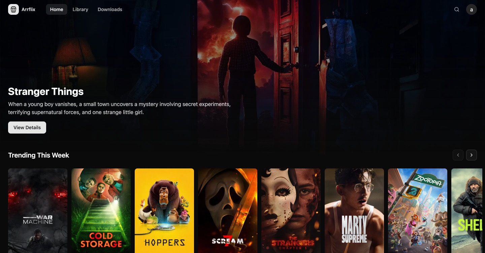

# Arrflix

Arrflix is a self-hosted media manager that combines the core functionality of Sonarr and Radarr into a single application and Docker container.

Browse trending and popular content, find something you want, and download it. No need to know exactly what you're looking for ahead of time.



## Features

- **Single container.** One Docker image, one compose file. No juggling multiple \*arr apps.
- **Movies and series.** Manage both from a single UI instead of separate Sonarr/Radarr instances.
- **Policy engine.** Route content to different libraries, downloaders, or naming templates based on rules you define.
- **Built-in indexer support.** Prowlarr is bundled and managed automatically.
- **Name templates.** Control exactly how files are renamed and organized on import.
- **Hardlink-first imports.** Downloaded files are hardlinked into your library to save disk space.

## Project Status

Arrflix is under active development and usable today for manual search, download, and library management.

**What works well:**

- Searching indexers and downloading releases
- Importing completed downloads with custom naming
- Library scanning and TMDB metadata matching
- Multi-library and multi-downloader setups via the policy engine

**What’s still on the roadmap:**

- Automated monitoring (track titles and download new releases automatically)
- Request system (let other users request content)
- Quality profiles and auto-selection of releases

This is early adopter software. The core workflows are solid, but you may encounter rough edges. Breaking changes are possible between releases. Feedback and bug reports are welcome.

## Quick Start

Full documentation is available at **https://kyleaupton.github.io/arrflix/**

Start with the [Introduction](https://kyleaupton.github.io/arrflix/guide/introduction.html), then follow the [Getting Started](https://kyleaupton.github.io/arrflix/guide/getting-started.html) guide.

## Development Setup

### Requirements

- Docker & Docker Compose
- A TMDB API key

### Local Development

1. Clone the repository:

   ```bash
   git clone https://github.com/kyleaupton/arrflix.git
   cd arrflix
   ```

2. Create a `.env` file:

   ```env
   MEDIA_LIBRARIES=/path/to/test/media
   ```

3. Start the development stack:
   ```bash
   docker compose up
   ```

The backend, frontend, database, and supporting services all run together via Docker Compose.

## Contributing

Arrflix is a solo project that welcomes community involvement. Bug reports, feature suggestions, and discussions are encouraged via [Issues](https://github.com/kyleaupton/arrflix/issues).

Pull requests are welcome, though larger changes should be discussed first to make sure they align with the project’s direction.

## License

GPL-3.0

## Third-Party Software

This project bundles the following third-party software, each distributed under its own license:

- [Prowlarr](https://github.com/Prowlarr/Prowlarr) — GPL-3.0
- [guessit](https://github.com/guessit-io/guessit) — LGPL-3.0
